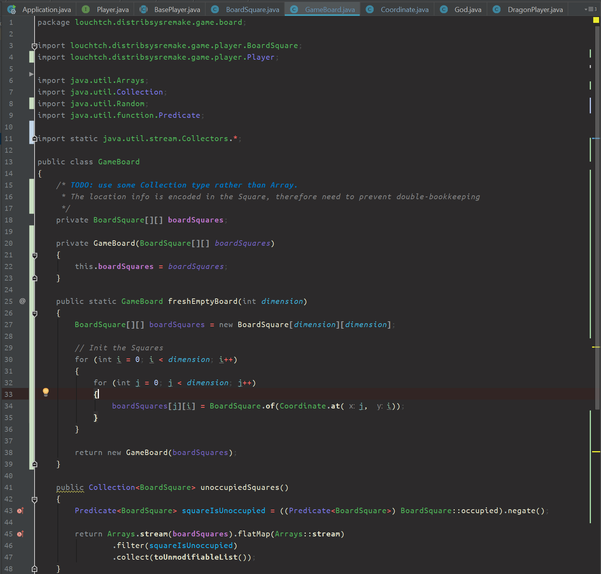

# Louchtch's dark IntelliJ theme

## Short intro

This theme was created to be used together with the factory, dark IntelliJ UI theme. It has a strong *semantic highlighting* feel. Interfaces are blue-ish, classes green, semantic highlighting of variables uses strong colors instead of very subdued default ones.

## Languages supported
- Java
- Gradle (it looks Java-like in the buildscripts I have opened using this theme)
- Others: no guarantees, before tweaking, Gradle scripts did not look like I configured Java colors. And I stayed in the general settings as much as possible. Any contributions welcome, but I'm not getting my hopes up. So it all comes down to which languages I write or read in IntelliJ and how _often_.

## Main goals

- Easier on the eyes when coding in dark environments
- Not too dark, must be usable in when sunny (but not direct sunlight on a laptop screen)
- Looks good with the default IntelliJ dark UI theme
- De-emphasize keywords (new, control flow, loops and access modifiers are not interesting _enough_)
- Emphasize the important parts (operators and variables, for example)*
- Be sane, no mental noise that distracts from the task at hand (=work in progress)*

*) you might wonder: why the strong colors for Classes and Interfaces? Answer: I want to highlight for myself when I'm not "thinking in interfaces". Because I'm experimenting with [Yegor Bugayenko](https://www.yegor256.com/books.html)'s suggestions. 

## Issues

- The TODO's in comments probably need to get a more subdued color. Or just a different one, that still stands out, strongly. Need to have some extra motivation to get those TODO's done or reconsidered.
- Interfaces and Classes colors might be a little bit too "busy"-looking. Already toned the color down a bit, but they are still quite dominant.
- Not happy with squiggly line warnings, but that's more of an issue with what kinds of warning I like to see. From time to time, some of them are useful. Can't expect the IDE to read my mind. Maybe a bit more subdued color will be used in the future...

