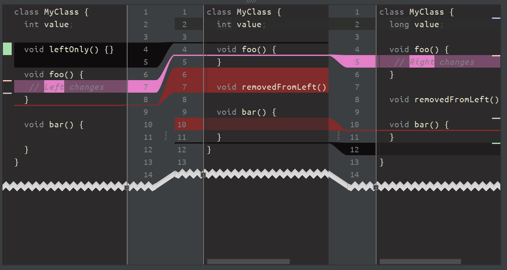

# Louchtch's dark IntelliJ theme

## Short intro

This theme was created to be used together with the dracula IntelliJ UI theme. It has a *semantic highlighting* feel. Interfaces are blue-ish, classes green, semantic highlighting of variables uses strong colors instead of very subdued default ones. De-emphasises clutter.

## Languages supported
- Java
- Gradle (those I've opened, look decent)
- TypeScript
- Others: no guarantees, probably will need tweaking

## Main goals

- Easier on the eyes when coding in dark environments
- Not too dark, must be usable in when sunny (but not direct sunlight on a laptop screen)
- Looks good with the default IntelliJ dark UI theme
- De-emphasize keywords (new, control flow, loops and access modifiers are not interesting _enough_)
- Emphasize the important parts (operators and variables, for example)*
- Be sane, no mental noise that distracts from the task at hand (=work in progress)*

*) you might wonder: why the strong colors for Classes and Interfaces? Answer: I want to remind myself I'm not "thinking in interfaces". Currently experimenting with [Yegor Bugayenko](https://www.yegor256.com/books.html)'s suggestions. 

## Issues

- Interface and Class colors might clash with the semantic variable colors. 
- Not happy with squiggly line warning colors, it's a trade-off. You'll have to dive into the inspections and get the settings right for yourself.

