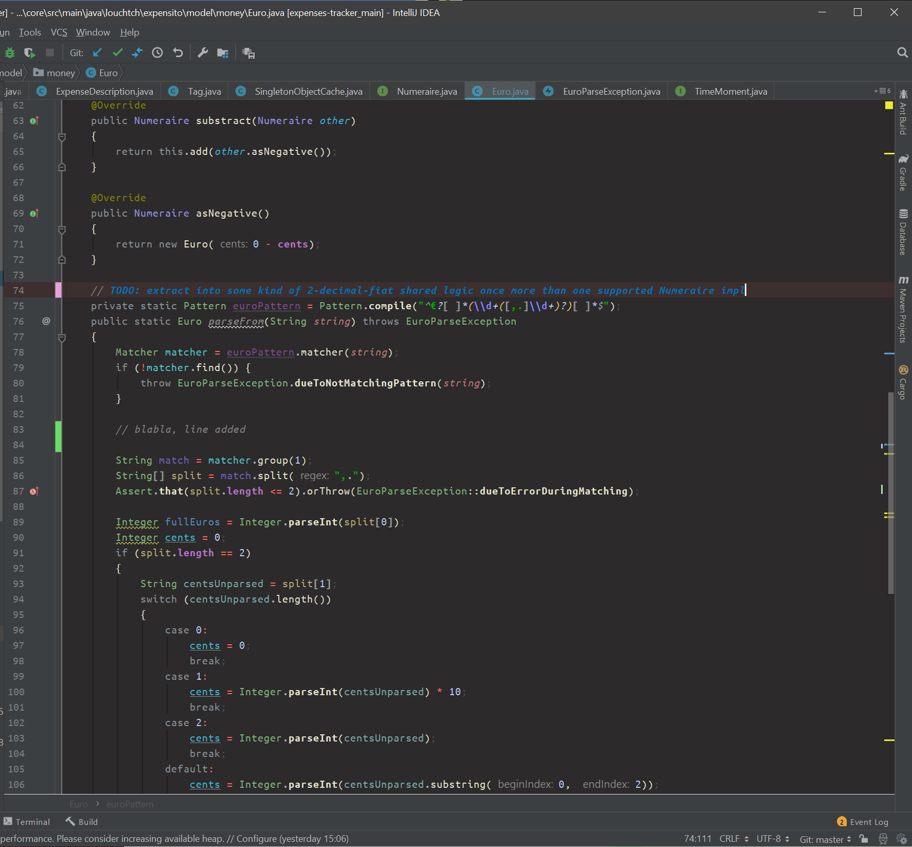

# Louchtch's dark IntelliJ theme

## Short intro

This theme was created to be used together with the dark IntelliJ application theme. It has a strong *semantic highlighting* feel. Interfaces are blue-ish, classes green, semantic highlighting of variables uses strong colors instead of subdued default ones.

## Main goals

- Easier on the eyes when coding in darker environments
- Not too black
- Look good with the default dark UI theme
- De-emphasize certain keywords (new, control flow, loops and access modifiers are just not that interesting)
- Emphasize the more interesting parts (operators and variables, for example)

## Issues

- The TODO's in comments probably need to get a more subdued color.
- Errors might be highlighted too strong and makes the caret not visible enough, don't know how to fix the caret there without changing the highlight color itself
- Interfaces and Classes colors might be a little bit too "busy"-looking. Still evaluating, but I had a personal reason for doing this.
- Not happy with squiggly line warnings, but that's more of an issue with what kinds of warning I like to see. Some of them are sometimes useful and other times annoying. Maybe a bit more subdued color will be used in the future...

